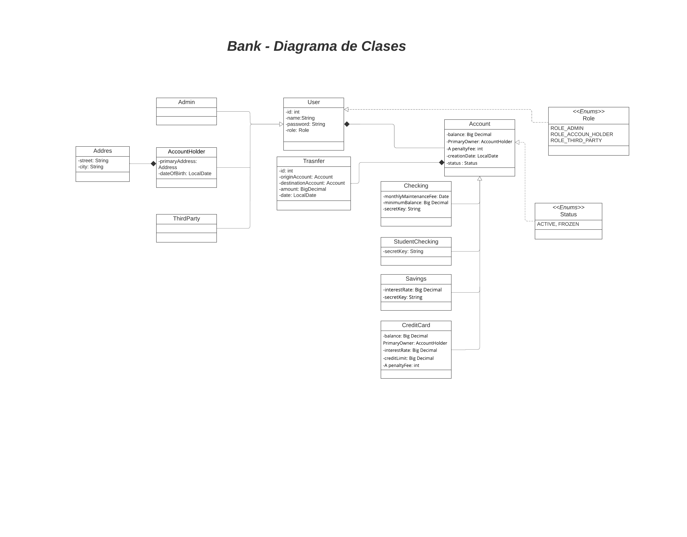
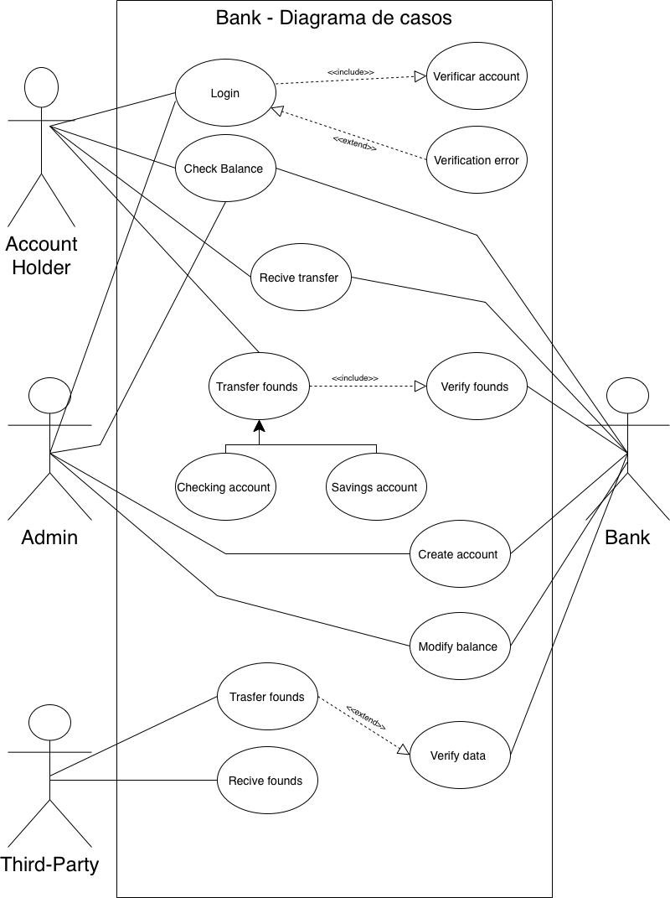

# Ironhack Bank Project

## Requisitos:

- Tener instalado Java 17.
- Tener instalado mysql.
- Crear base de datos: `bank`

## Documentación

Habrá un usuario con role admin con estas credencias:

- username: `admin`
- password: `admin`

Este es el listado de endpoints

- POST `/users/admin` -> Roles: `ADMIN`

```
{
    "name": String,
    "password": String
}
```

- POST `/users/account-holder` -> Roles: `ADMIN`

```
{
    "name": String,
    "password": String,
    "street": String,
    "city": String,
    "birthday": LocalDate
}
```

- POST `/users/third-party` -> Roles: `ADMIN`

```
{
    "name": String,
    "hashKey": String
}
```

- GET `/accounts` -> Roles: `ACCOUNT_HOLDER,ADMIN`

- GET `/accounts/{accountId}` -> Roles: `ACCOUNT_HOLDER,ADMIN`

- PATCH `/accounts/{accountId}` -> Roles: `ADMIN`

```
{
    "balance": BigDecimal
}
```

- POST `/accounts/savings` -> Roles: `ADMIN`

```
{
    "balance": BigDecimal,
    "date": LocalDate,
    "status": Status,
    "primaryOwner": AccountHolder,
    "interestRate": BigDecimal,
    "secretKey": String
}
```

- POST `/accounts/checkings` -> Roles: `ADMIN`

```
{
    "balance": BigDecimal,
    "date": LocalDate,
    "status": Status,
    "primaryOwner": AccountHolder,
    "secretKey": String
}
```

- POST `/accounts/credit-cards` -> Roles: `ADMIN`

```
{
    balance: BigDecimal,
    penaltyFree: int,
    date: LocalDate,
    status: Status,
    primaryOwner: User,
    interestRate: BigDecimal,
    creditLimit: BigDecimal
}
```

- POST `/transfers` -> Roles: `ACCOUNT_HOLDER`

```
{
    "originAccountId": int,
    "destinationAccountId": int,
    "amount": double
}
```

- POST `/transfers/external/send` -> Roles: `N/A`

```
{
    "accountId": int,
    "amount": double
}
```

- POST `/transfers/external/receive` -> Roles: `N/A`

```
{
    "accountId": int,
    "secretKey": String,
    "amount": double
}
```

## Diagrama de clases



## Diagrama de casos de uso

